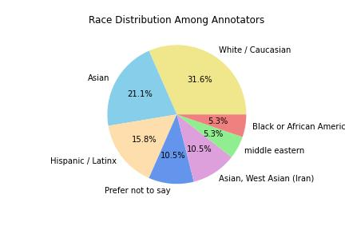
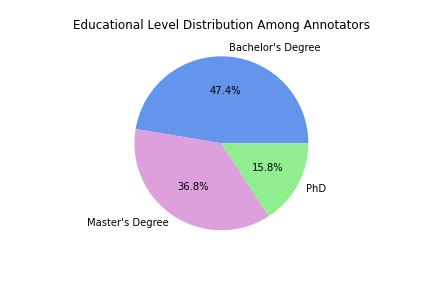

# educational_CQG
Anonymopus repository for the AIED Late Breaking Results submission number X.

All generations from InstructGPT have been included in the interest of promoting reproducibility despite the changing parameters when querying OpenAI's models.

## Project Abstract
The educational domain has the potential to benefit greatly from controllable text generation by large language models. Specifically, high quality generation of diverse questions can reduce the load on teachers to make educational content. Recent work here has made huge progress with automatic and crowd-sourced metrics; but fails to show that real teachers judge the questions as sufficiently useful for the classroom setting. We conduct a large scale human evaluation with teachers to assess the quality and usefulness of outputs from controllable question generation. The results show that these generations are high quality and useful, showing their promise for widespread use in real classroom settings.

## Control Elements - Taxonomic Categories
| Prompt | Taxonomy | Definition |
|---|---|---|
| remembering | Bloom's | The question should ask students to retrieve from memory a fact, term, concept, etc.. |
| understanding | Bloom's | The question should ask students to demonstrate their understanding of material by describing, explaining, comparing, interpreting, etc. |
| applying | Bloom's | The question should ask students to use the presented concepts to solve problems, or explain ideas in a different way. |
| analyzing | Bloom's | The question should ask students to break material into parts, and/or show how different ideas relate to one another. |
| evaluating | Bloom's | The question should ask students to give opinions on, make judgments about, or interpret meaning from material. |
| creating | Bloom's | The question should ask students to combine material together in a different way than it was presented. |
| beginner | Level | The question should be posed so that the correct answer is a simple span from the input context (often a single concept or a list). |
| intermediate | Level | The question should be posed so that the correct answer is a span from the input context that is more complex than a single concept (eg. an explanation or an example), or requires understanding on the part of the student to arrive at a simple answer. |
| advanced | Level | The question should be posed so that the correct answer requires a student's rephrasing of multiple parts of the input, or the answer must require independent thought. |

## Teacher Assessment Metrics
| Metric | Definition |
|---|---|
| relevance | A binary variable representing if the question is related to the context provided. In order for a question to be on topic, at least one key concept from the context passage must be referenced or mentioned in the candidate (note that the context doesn't necessarily have to contain the answer to the question on this concept). |
| grammar| A binary variable representing if the question is grammatically correct. Any grammatical error (including capitalization or other minor errors) results in an ungrammatical question. |
| adherence | A binary variable representing if the question is an instance of the question type provided. This is done with the definitions of question types at the discretion of the annotator. |
| answerable | A binary variable representing if there is a text span from the context that answers the question, or that could lead to an answer with no other information required (e.g., a student's opinion about presented facts could be answerable). Note that any reasonable answer is acceptable, it does not have to be the best/most complete answer to the question. |
| useful | We define the 'usefulness metric' as a teacher's own answer to the question:  “Assume you wanted to teach about context X. Do you think candidate Y would be useful in a lesson, home work, quiz, etc.?” where X is replaced by the context passage, and Y is replaced by the candidate question.  |

The ordinal values the usefulness metric can hold are as follows: 
1. Not useful = The core content of the question is not useful to teach context X at all. For example, the candidate might be off topic, have logical issues, simply not a useful question to teach context X, or be otherwise unacceptable. 
2. Useful with major edits = The core content of the question is useful, but the phrasing or presentation of the candidate is not, and would require changes that take more than a minute. For example, the candidate might present an interesting idea that would be useful to teach context X, but the sentence structure is confusing and would need to be completely re-written. 
3. Useful with minor edits = The core content of the question is useful, but the phrasing or presentation of the candidate has some minor issues (e.g. grammatical errors, word choice problems) that could be fixed in less than a minute. 
4. Useful with no edits = The question is useful as is, and can be used directly without making any changes.  
Note that the question does not necessarily need to be answerable from the context or adhere to the question type in order to be considered useful.

## Generation Examples and Corresponding Annotations
### Biology Domain
#### Context Passage
Decomposition or rot is the process by which dead organic substances are broken down into simpler organic or inorganic matter such as carbon dioxide, water, simple sugars and mineral salts. The process is a part of the nutrient cycle and is essential for recycling the finite matter that occupies physical space in the biosphere. Bodies of living organisms begin to decompose shortly after death. Animals, such as worms, also help decompose the organic materials. Organisms that do this are known as decomposers or detritivores. Although no two organisms decompose in the same way, they all undergo the same sequential stages of decomposition. The science which studies decomposition is generally referred to as taphonomy from the Greek word taphos, meaning tomb. Decomposition can also be a gradual process for organisms that have extended periods of dormancy.
#### Examples
| Generated Candidate | Question Taxonomy (as CTG Control Element) | Relevance | Grammar | Adherence | Answerable | Usefulness | Reason |
|---|---|---|---|---|---|---|---|
| What is the process of decomposition called? | remembering | 1 | 1 | 1 | 1 | Not useful | The question has logical issues or doesn't make sense |
| What is the purpose of decomposition in the biosphere? | understanding | 1 | 1 | 1 | 1 | Useful with no edits |  |
| What is the name of the science that studies decomposition? | creating | 1 | 1 | 0 | 1 | Useful with no edits |  |

### Machine Learning Domain
#### Context Passage
Machine translation, sometimes referred to by the abbreviation MT (not to be confused with computer-aided translation, machine-aided human translation or interactive translation), is a sub-field of computational linguistics that investigates the use of software to translate text or speech from one language to another. On a basic level, MT performs mechanical substitution of words in one language for words in another, but that alone rarely produces a good translation because recognition of whole phrases and their closest counterparts in the target language is needed. Not all words in one language have equivalent words in another language, and many words have more than one meaning. Solving this problem with corpus statistical and neural techniques is a rapidly growing field that is leading to better translations, handling differences in linguistic typology, translation of idioms, and the isolation of anomalies. Current machine translation software often allows for customization by domain or profession (such as weather reports), improving output by limiting the scope of allowable substitutions. This technique is particularly effective in domains where formal or formulaic language is used.
#### Examples
| Generated Candidate | Question Taxonomy (as CTG Control Element) | Relevance | Grammar | Adherence | Answerable | Usefulness | Reason |
|---|---|---|---|---|---|---|---|
| What techniques are used in machine translation to improve output and handle differences in linguistic typology? | applying | 1 | 1 | 0 | 0 | Useful with minor edits |  |
| What is the abbreviation for machine translation? | beginner | 1 | 1 | 1 | 1 | Not useful | I think this is not helpful for the real learning goal of the context |
| What are the challenges of machine translation? | intermediate | 1 | 1 | 1 | 1 | Useful with no edits |  |

## Annotator Demographics
In following the theme of AIED 2023, we want to be transparent about the composition of our annotator set. The following displays the distributions of gender, race, and education (level and field of study).

## Result Tables
N.b. These results do not include the 'agreement passage' which was annotated by all annotators to assess their inter-annotator agreemeent on the task.
### Biology Domain
| Question Taxonomy | n | Relevance (avg) | Relevance (std) | Grammar (avg) | Grammar (std) | Adherence (avg) | Adherence (std) | Answerable (avg) | Answerable (std) | Useful (avg) | Useful (std) |
|---|---|---|---|---|---|---|---|---|---|---|---|
| all candidates | 36 | 0.9667 | 0.1798 | 0.9630 | 0.1897 | 0.6741 | 0.4696 | 0.9259 | 0.2631 | 3.507 | 0.6884 |
| remembering | 36 | 0.9167 | 0.2803 | 0.9333 | 0.2537 | 0.9167 | 0.2803 | 0.9667 | 0.1826 | 3.7083 | 0.5901 |
| understanding | 36 | 0.9722 | 0.1667 | 0.9667 | 0.1826 | 0.7778 | 0.4216 | 1.0000 | 0.0000 | 3.7361 | 0.4051 |
| applying | 36 | 0.9722 | 0.1667 | 1.0000 | 0.0000 | 0.5833 | 0.5000 | 0.9000 | 0.3051 | 3.5556 | 0.7049 |
| analyzing | 36 | 0.9722 | 0.1667 | 1.0000 | 0.0000 | 0.7500 | 0.4392 | 0.9333 | 0.2537 | 3.5833 | 0.7416 |
| evaluating | 36 | 0.9722 | 0.1667 | 0.9333 | 0.2537 | 0.4722 | 0.5063 | 0.8000 | 0.4068 | 3.6528 | 0.6635 |
| creating | 36 | 1.0000 | 0.0000 | 0.9667 | 0.1826 | 0.3611 | 0.4871 | 1.0000 | 0.0000 | 3.6806 | 0.5231 |
| beginner | 36 | 1.0000 | 0.0000 | 1.0000 | 0.0000 | 0.8333 | 0.3780 | 0.9667 | 0.1826 | 3.5417 | 0.7780 |
| intermediate | 36 | 1.0000 | 0.0000 | 0.9667 | 0.1826 | 0.6389 | 0.4871 | 0.9333 | 0.2537 | 3.6111 | 0.7082 |
| advanced | 36 | 0.9444 | 0.2323 | 0.9667 | 0.1826 | 0.8889 | 0.3187 | 0.8667 | 0.3457 | 3.2639 | 0.8659 |

### Machine Learning Domain
| Question Taxonomy | n | Relevance (avg) | Relevance (std) | Grammar (avg) | Grammar (std) | Adherence (avg) | Adherence (std) | Answerable (avg) | Answerable (std) | Useful (avg) | Useful (std) |
|---|---|---|---|---|---|---|---|---|---|---|---|
| all candidates | 30 | 0.9722 | 0.1646 | 0.9704 | 0.1699 | 0.6914 | 0.4626 | 0.9296 | 0.2562 | 3.5926 | 0.6820 |
| remembering | 30 | 0.9667 | 0.1826 | 1.0000 | 0.0000 | 0.8333 | 0.3790 | 1.0000 | 0.0000 | 3.7833 | 0.3869 |
| understanding | 30 | 1.0000 | 0.0000 | 0.9167 | 0.2887 | 0.8000 | 0.4068 | 0.8333 | 0.3892 | 3.5833 | 0.6029 |
| applying | 30 | 0.9667 | 0.1826 | 1.0000 | 0.0000 | 0.6667 | 0.4795 | 0.8333 | 0.3892 | 3.6000 | 0.6074 |
| analyzing | 30 | 0.9667 | 0.1826 | 0.8333 | 0.3892 | 0.7333 | 0.4498 | 0.9167 | 0.2887 | 3.3333 | 0.8743 |
| evaluating | 30 | 0.9333 | 0.2537 | 1.0000 | 0.0000 | 0.5333 | 0.5074 | 0.8333 | 0.3892 | 3.4167 | 0.8209 |
| creating | 30 | 0.9333 | 0.2537 | 1.0000 | 0.0000 | 0.4000 | 0.4983 | 1.0000 | 0.0000 | 3.5167 | 0.6226 |
| beginner | 30 | 1.0000 | 0.0000 | 1.0000 | 0.0000 | 0.6333 | 0.4901 | 1.0000 | 0.0000 | 3.7333 | 0.5683 |
| intermediate | 30 | 0.9667 | 0.1826 | 1.0000 | 0.0000 | 0.6667 | 0.4795 | 1.0000 | 0.0000 | 3.6167 | 0.5826 |
| advanced | 30 | 0.9667 | 0.1826 | 0.9167 | 0.2887 | 0.8000 | 0.4068 | 0.9167 | 0.2887 | 2.9833 | 0.7368 |